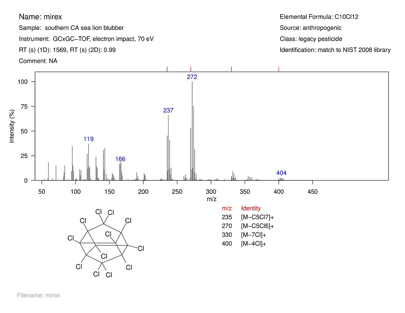

%\VignetteEngine{knitr::knitr}
%\VignetteIndexEntry{OrgMassSpecR Spectral Libraries}

Vignette for SpecLibExample: OrgMassSpecR Mass Spectral Libraries
==================================================

Nathan G. Dodder

March 2014

Introduction
--------------------------------------------------

`OrgMassSpecR` has companion packages that contain mass spectral libraries and functions to compile the libraries into PDF reports. Here, "library" refers to an organized collection of mass spectra, not a collection of R packages.

Each spectral library package is capable of generating a PDF report. This is intended as the primary mechanism for viewing a library, and provides a way to share a library independent of R. Pre-generated reports are not included in the packages. A NIST MSP text file can also be generated. This format can be used to import the spectra into the NIST MS Search software as a custom searchable library.

Within the package source, the spectra and metadata are stored in CSV format. The spectra consist of centroid _m/z_ values and intensities. Chemical structures may be stored in PNG format. 

The `SpecLibExample` package contains a set exogenous compounds identified in a sea lion blubber sample and is used here to illustrate the file structure and functionality of spectral library packages.

Generating Reports
--------------------------------------------------

Each package has its own `LibraryReport` function that generates the PDFs. The function is similar across packages, but differences exist to accommodate the the specific needs of the library/project. If multiple spectral library packages are loaded, the appropriate
function should be called using `packagename::LibraryReport()`. Each page of the PDF report is one spectrum and the associated metadata (compound name, etc.), as shown below.

The _m/z_ labels in the mass spectrum refer to the most abundant peak in the cluster.  The peak _m/z_ values listed in the table refer to the monoisotopic peak in the cluster.

Creating Spectral Library Packages
--------------------------------------------------

The following are notes on creating spectral library packages.

The `data` directory contains two CSV files. One contains all mass spectra, and the other the metadata for each compound. The help documentation for `LibraryReport` describes the required column names, which can vary by library package depending on the needs of the project. If used, the directory at `/inst/extdata/struct` contains PNG files of the chemical structures.

`LibraryReport` uses the filenames defined in the metadata to select the corresponding spectrum and structure. Therefore, these should be identically specified. The row order within the metadata file controls the page order of the report.

Spectra for the example library were exported from the instrument's data analysis software as NIST MSP text files. Each MSP file was
assigned a unique name. The function `OrgMassSpecR::ReadMspDirectory` was used to assemble the spectra into a single data frame.

Within `LibraryReport`, the PNG files at are read and converted to a raster object using `png::readPNG`. For the example library, the structures were drawn using BKchem, with a font size of 14 and line width of 1 px. They were exported as PNG (Cairo) files at 300 dpi resolution and with a transparent background.

